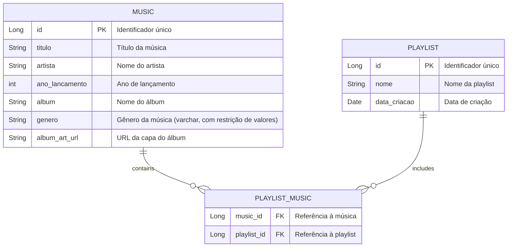

# 🎧 Playmix 

**Playmix** é uma aplicação de streaming de música que permite aos usuários criar e gerenciar suas próprias playlists de maneira simples e intuitiva. Com uma interface amigável, você pode descobrir novas músicas, explorar diferentes gêneros e personalizar suas coleções musicais de acordo com suas preferências.


## 📚 Estrutura do Banco de Dados

A aplicação utiliza um modelo de banco de dados relacional para gerenciar as informações das músicas, playlists e suas interações. Abaixo está o diagrama de Entidade e Relacionamento com as tabelas principais da estrutura do banco de dados:


---
## 🛤️ Rotas da Aplicação

### 🏠 Home (`index.html`)

- **Página Inicial**: `GET /`  
  A página inicial do Playmix, com opções para gerenciar músicas e playlists.   

> [!NOTE]
> **🔗 Acesse a página inicial através da URL:**
> ```plaintext
> http://playmixrm552258.eastus.azurecontainer.io:8080
> ```

### 🎵 Músicas (`MusicController`)
- **Listar**: `GET /musics`  - Exibe todas as músicas.  
- **Detalhes**: `GET /musics/{id}`  - Detalhes de uma música.  
- **Adicionar**: `GET /musics/new`  - Formulário para nova música.  
- **Salvar**: `POST /musics`  - Cria uma nova música. 🎤  
- **Editar**: `GET /musics/edit/{id}`  - Formulário para editar música. ✏️  
- **Atualizar**: `POST /musics/{id}`  - Atualiza uma música existente. 🔄  
- **Excluir**: `GET /musics/delete/{id}`  - Remove uma música. ❌  

### 🎶 Gerenciamento de Playlists (`PlaylistController`) 
- **Listar**: `GET /playlists`  - Exibe todas as playlists.  
- **Detalhes**: `GET /playlists/{id}`  - Detalhes de uma playlist. 📜  
- **Adicionar**: `GET /playlists/new`  - Formulário para nova playlist. ➕  
- **Salvar**: `POST /playlists`  - Cria uma nova playlist. 🎼  
- **Editar**: `GET /playlists/edit/{id}`  - Formulário para editar playlist. ✏️  
- **Atualizar**: `POST /playlists/{id}`  - Atualiza uma playlist existente. 🔄  
- **Excluir**: `GET /playlists/delete/{id}`  - Remove uma playlist. ❌  
---

## CRUD - Exemplos 📋

### 1. Criar 🎤

#### *Música*

Para criar uma nova música, você deve enviar um formulário com as seguintes informações:

```plaintext
Título: Baby
Artista: Justin Bieber
Ano de Lançamento: 2010
Álbum: My World 2.0
Gênero: POP
URL da Capa do Álbum: https://abrir.link/jtJPk
```

#### *Playlist*

Para criar uma nova playlist, você pode usar o seguinte formulário:

```plaintext
Nome: Nostalgia Playlist
(Selecione as músicas )
```


### 2. Ler 📖

#### *Música*

Para ler os detalhes de uma música específica, aperte em 'Detalhes'.


#### *Playlist*

Para ler os detalhes de uma playlist específica, aperte em 'Detalhes'.


### 3. Atualizar ✏️

#### *Música*

Para atualizar as informações de uma música existente, você pode enviar o seguinte formulário:

```plaintext
Título: Baby Music
Artista: Justin
Ano de Lançamento: 2011
Álbum: My World 2.0.0
Gênero: SOUL
URL da Capa do Álbum: https://abrir.link/jtJPk
```

#### *Playlist*

Para atualizar uma playlist existente, você pode usar o seguinte formulário:

```plaintext
Nome: Pop Nostalgia Favoritas
```

### 4. Excluir 🗑️

#### *Música*

Para excluir uma música, aperte em 'Excluir'.

#### *Playlist*

Para excluir uma playlist, aperte em 'Excluir'.


---

## 🌐 Aplicação Rodando na Nuvem

Aqui está uma captura de tela da aplicação **Playmix** rodando na nuvem:


---

## 📂 Recursos Adicionais

- **Docker Documentation**: [https://docs.docker.com/](https://docs.docker.com/) 📖
- **Azure Container Registry**: [https://docs.microsoft.com/pt-br/azure/container-registry/](https://docs.microsoft.com/pt-br/azure/container-registry/) ☁️
- **Azure Container Instances**: [https://docs.microsoft.com/pt-br/azure/container-instances/](https://docs.microsoft.com/pt-br/azure/container-instances/) 🌍
- **Spring Boot Docker Documentation**: [https://spring.io/guides/gs/spring-boot-docker/](https://spring.io/guides/gs/spring-boot-docker/)

---

## 📄 Documentação Adicional

- **Código Fonte**: [GitHub Repository](https://github.com/laiscrz/playmix-application-mvc) 📁
- **Vídeo de Demonstração**: [YouTube Video](https://www.youtube.com/watch?v=88ot8dEYOY0) 📹

## 🫂 Integrantes

Aqui estão os membros do grupo que participaram durante desenvolvimento deste Checkpoint.

* **RM 552258 - Laís Alves da Silva Cruz**
  - Turma: 2TDSPH

* **RM 552267 - Bianca Leticia Román Caldeira**
  - Turma: 2TDSPH
    
* **RM 552252 – Charlene Aparecida Estevam Mendes Fialho**
  - Turma: 2TDSPH

* **RM 97916 – Fabricio Torres Antonio**
  - Turma: 2TDSPH


<table>
  <tr>
    <td align="center">
      <a href="https://github.com/laiscrz">
        <br>
        <sub>
          <b>Lais Alves</b>
        </sub>
      </a>
    </td>
        <td align="center">
      <a href="https://github.com/biancaroman">
        <br>
        <sub>
          <b>Bianca Román</b>
        </sub>
      </a>
    </td>
    <td align="center">
      <a href="https://github.com/charlenefialho">
        <br>
        <sub>
          <b>Charlene Aparecida</b>
        </sub>
      </a>
    </td>
     <td align="center">
      <a href="https://github.com/Fabs0602">
        <br>
        <sub>
          <b>Fabricio Torres</b>
        </sub>
      </a>
    </td>
  </tr>
</table>

